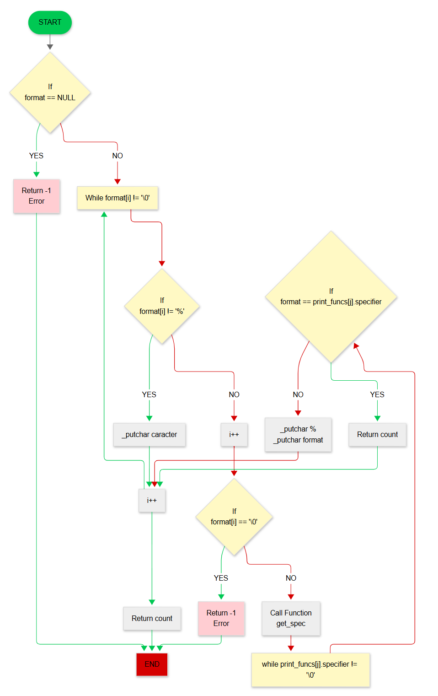

# holbertonschool-printf

## Description (English)

This project is a simplified re-implementation of the C language `printf` function. It allows formatted strings to be printed to the standard output, supporting several types of format specifiers.

## Project Structure

```
holbertonschool-printf/
├── main.h                    # Header file with prototypes and structures
├── _printf.c                 # Main _printf function implementation
├── _putchar.c               # Character output function
├── spec_functions.c         # Format specifier handler functions
├── get_spec_functions.c     # Format specifier selection logic
├── main.c                   # Test file with examples
├── man_3_printf            # Manual page for _printf
├── printf                  # Compiled executable
├── README.md               # This file
├── gitignore              # Git ignore patterns
└── img/                   # Documentation images
    └── man_3_printf.png # Screenshot of the manual page
    └── flowcharts.png    # Flowchart of the _printf function
```

**Documentation image:**  



## Main Functions

### Core Functions
- [`_printf`](_printf.c): Main function that processes format strings and arguments
- [`_putchar`](_putchar.c): Writes a single character to stdout
- [`get_spec`](get_spec_functions.c): Selects appropriate handler function for format specifiers

### Format Specifier Handlers
- [`print_char`](spec_functions.c): Handles `%c` specifier for characters
- [`print_string`](spec_functions.c): Handles `%s` specifier for strings  
- [`print_integer`](spec_functions.c): Handles `%d` and `%i` specifiers for integers
- [`print_percent`](spec_functions.c): Handles `%%` specifier for literal percent signs

## Compilation

To compile the project:

```sh
gcc -Wall -Werror -Wextra -pedantic *.c -o printf
```

## Usage

Example usage in a C program:

```c
#include "main.h"

int main(void)
{
    int len;
    
    len = _printf("Hello %s! Number: %d%%\n", "world", 42);
    _printf("Characters printed: %d\n", len);
    
    return (0);
}
```

## Supported Format Specifiers

| Specifier | Description         | Function Handler |
|-----------|---------------------|------------------|
| `%c`      | Single character    | `print_char`     |
| `%s`      | String of characters| `print_string`   |
| `%d`      | Decimal integer     | `print_integer`  |
| `%i`      | Integer             | `print_integer`  |
| `%%`      | Literal % character | `print_percent`  |

## Return Value

- On success: Returns the number of characters printed (excluding null terminator)
- On error: Returns -1 (e.g., when format string is NULL)

## Implementation Details

- Uses variadic arguments (`stdarg.h`) to handle multiple parameters
- Implements a structure-based approach for format specifier handling
- Custom `_putchar` function uses the `write` system call for output
- Handles edge cases like NULL strings and integer overflow

## Testing

The project includes a comprehensive test file ([main.c](main.c)) that compares output with the standard `printf` function, testing various format specifiers and edge cases.

## Manual Page

A custom manual page is provided in [man_3_printf](man_3_printf) following the standard Unix manual format.

---

## Description (Français)

Ce projet est une ré-implémentation simplifiée de la fonction `printf` du langage C. Il permet d'afficher des chaînes de caractères formatées à la sortie standard, en gérant plusieurs types de spécificateurs de format.

## Structure du projet

```

holbertonschool-printf/
├── main.h                    # Fichier d'en-tête avec prototypes et structures
├── _printf.c                 # Implémentation de la fonction principale _printf
├── _putchar.c               # Fonction de sortie de caractères
├── spec_functions.c         # Fonctions gestionnaires des spécificateurs de format
├── get_spec_functions.c     # Logique de sélection des spécificateurs de format
├── main.c                   # Fichier de test avec exemples
├── man_3_printf            # Page de manuel pour _printf
├── printf                  # Fichier exécutable compilé
├── README.md               # Ce fichier
├── gitignore              # Modèles d'exclusion Git
└── img/                   # Images de documentation
    └── man_3_printf.png # Capture d'écran de la page de manuel
    └── flowcharts.png    # Diagramme de flux de la fonction _printf
```

**Documentation image:**  


### Fonctions centrales
- [`_printf`](_printf.c) : Fonction principale qui traite les chaînes de format et les arguments
- [`_putchar`](_putchar.c) : Écrit un caractère unique vers stdout
- [`get_spec`](get_spec_functions.c) : Sélectionne la fonction appropriée pour les spécificateurs de format

### Gestionnaires de spécificateurs
- [`print_char`](spec_functions.c) : Gère le spécificateur `%c` pour les caractères
- [`print_string`](spec_functions.c) : Gère le spécificateur `%s` pour les chaînes
- [`print_integer`](spec_functions.c) : Gère les spécificateurs `%d` et `%i` pour les entiers
- [`print_percent`](spec_functions.c) : Gère le spécificateur `%%` pour le signe pourcentage littéral

## Compilation

Pour compiler le projet :

```sh
gcc -Wall -Werror -Wextra -pedantic *.c -o printf
```

## Utilisation

Exemple d'utilisation dans un programme C :

```c
#include "main.h"

int main(void)
{
    int len;
    
    len = _printf("Bonjour %s! Nombre: %d%%\n", "monde", 42);
    _printf("Caractères imprimés: %d\n", len);
    
    return (0);
}
```

## Spécificateurs supportés

| Spécificateur | Description | Fonction gestionnaire |
|---------------|-------------|-----------------------|
| `%c` | Caractère unique | `print_char` |
| `%s` | Chaîne de caractères | `print_string` |
| `%d` | Entier décimal | `print_integer` |
| `%i` | Entier | `print_integer` |
| `%%` | Caractère % littéral | `print_percent` |

## Valeur de retour

- En cas de succès : Retourne le nombre de caractères imprimés (sans le terminateur null)
- En cas d'erreur : Retourne -1 (par exemple, quand la chaîne de format est NULL)

## Détails d'implémentation

- Utilise les arguments variadiques (`stdarg.h`) pour gérer plusieurs paramètres
- Implémente une approche basée sur des structures pour la gestion des spécificateurs
- La fonction `_putchar` personnalisée utilise l'appel système `write` pour la sortie
- Gère les cas limites comme les chaînes NULL et le débordement d'entiers

## Tests

Le projet inclut un fichier de test complet ([main.c](main.c)) qui compare la sortie avec la fonction `printf` standard, testant divers spécificateurs de format et cas limites.

## Page de manuel

Une page de manuel personnalisée est fournie dans [man_3_printf](man_3_printf) suivant le format standard des manuels Unix.

## Auteurs

- Nicolai Carabet
- Mickael Mur

## Licence

Projet réalisé dans le cadre de la formation Holberton School. Utilisation personnelle et éducative uniquement.

---

## Описание (Русский)

Этот проект представляет собой упрощенную реализацию функции `printf` языка C. Он позволяет выводить форматированные строки на стандартный вывод, поддерживая несколько типов спецификаторов формата.

## Структура проекта

```
holbertonschool-printf/
├── main.h                    # Заголовочный файл с прототипами и структурами
├── _printf.c                 # Реализация основной функции _printf
├── _putchar.c               # Функция вывода символов
├── spec_functions.c         # Функции-обработчики спецификаторов формата
├── get_spec_functions.c     # Логика выбора спецификаторов формата
├── main.c                   # Тестовый файл с примерами
├── man_3_printf            # Страница руководства для _printf
├── printf                  # Скомпилированный исполняемый файл
├── README.md               # Этот файл
├── gitignore              # Шаблоны игнорирования Git
└── img/                   # Изображения документации
    └── man_3_printf.png # Скриншот страницы руководства
    └── flowcharts.png    # Блок-схема функции _printf
```

**Изображения документации:**  


### Центральные функции
- [`_printf`](_printf.c): Основная функция, которая обрабатывает строки формата и аргументы
- [`_putchar`](_putchar.c): Записывает один символ в stdout
- [`get_spec`](get_spec_functions.c): Выбирает подходящую функцию-обработчик для спецификаторов формата

### Обработчики спецификаторов
- [`print_char`](spec_functions.c): Обрабатывает спецификатор `%c` для символов
- [`print_string`](spec_functions.c): Обрабатывает спецификатор `%s` для строк
- [`print_integer`](spec_functions.c): Обрабатывает спецификаторы `%d` и `%i` для целых чисел
- [`print_percent`](spec_functions.c): Обрабатывает спецификатор `%%` для литерального знака процента

## Компиляция

Для компиляции проекта:

```sh
gcc -Wall -Werror -Wextra -pedantic *.c -o printf
```

## Использование

Пример использования в программе на C:

```c
#include "main.h"

int main(void)
{
    int len;
    
    len = _printf("Привет %s! Число: %d%%\n", "мир", 42);
    _printf("Напечатано символов: %d\n", len);
    
    return (0);
}
```

## Поддерживаемые спецификаторы

| Спецификатор | Описание | Функция-обработчик |
|--------------|----------|--------------------|
| `%c` | Одиночный символ | `print_char` |
| `%s` | Строка символов | `print_string` |
| `%d` | Десятичное целое число | `print_integer` |
| `%i` | Целое число | `print_integer` |
| `%%` | Литеральный символ % | `print_percent` |

## Возвращаемое значение

- При успехе: Возвращает количество напечатанных символов (исключая нулевой терминатор)
- При ошибке: Возвращает -1 (например, когда строка формата равна NULL)

## Детали реализации

- Использует переменные аргументы (`stdarg.h`) для обработки множественных параметров
- Реализует подход, основанный на структурах, для обработки спецификаторов формата
- Пользовательская функция `_putchar` использует системный вызов `write` для вывода
- Обрабатывает граничные случаи, такие как NULL-строки и переполнение целых чисел

## Тестирование

Проект включает комплексный тестовый файл ([main.c](main.c)), который сравнивает вывод со стандартной функцией `printf`, тестируя различные спецификаторы формата и граничные случаи.

## Страница руководства

Пользовательская страница руководства предоставлена в [man_3_printf](man_3_printf), следуя стандартному формату Unix-руководств.

## Авторы

- Николай Карабет
- Микаэль Мюр

## Лицензия

Проект выполнен в рамках обучения в Holberton School. Только для личного и образовательного использования.
